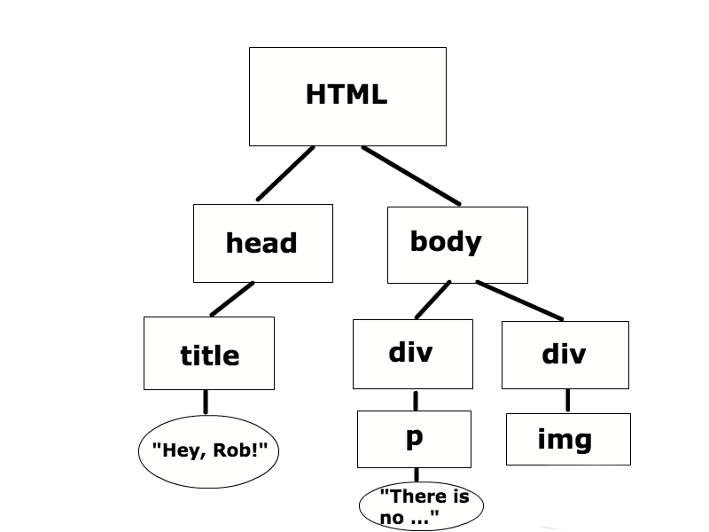
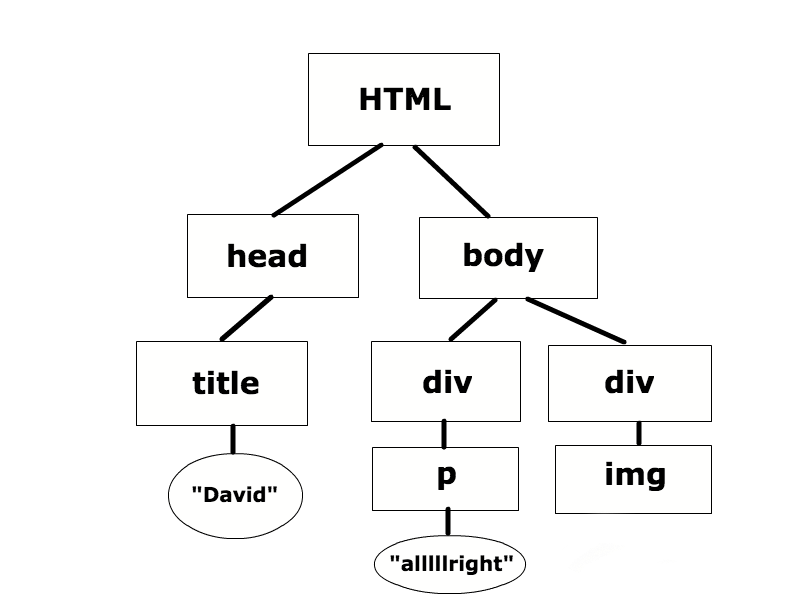

# CS50 Section. Week 10. 11/8/16.
*Tuesdays 4-5:30 PM, CGIS S-040*  

> Nicholas Boucher
> nboucher@college.harvard.edu  

# Important links
* This week's material on Study50: [Study50](https://study.cs50.net/javascript)
* CS50 Discuss: https://cs50.harvard.edu/discuss
* CS50 General Style Guide: https://manual.cs50.net/style/
* Python Style Guide: https://www.python.org/dev/peps/pep-0008/

# Section Agenda
1. JavaScript
2. DOM
3. jQuery
4. AJAX

# JavaScript
JavaScript is a *client-side*  programming language designed to run in a user's web browser to provide dynamic actions, communication, and content loading to web pages. The basic syntax of JavaScript looks fairly similar to C, although more advances features of the language include *imperative*, *functional*, and *object-oriented* characteristics. While *object-oriented* languages should be a familiar term, don't worry about the difference between *imperative* and *functional* languages for now.

Like Python, JavaScript is an interpreted language. This means that you do not need to compile your JavaScript code -- everything is interpreted by the browser at runtime. This means that JavaScript will inherently be slower than compiled languages like C, but you will likely never notice the speed difference because of the immense power and speed of modern computers.

JavaScript can be "embedded" into any given HTML document in one of two ways. First, you can simply write JavaScript between `<script>` tags within your HTML document. An example of using this method, called in-line scripting, is as follows:

```HTML
<html>
  <head>
    ...
  </head>
  <body>
    ...
    <script type="text/javascript">
      // Your JavaScript Code Here
    </script>
  </body>
</html>
```

The other method to embed JavaScript within your HTML document is to save the JavaScript code in a separate file with a `.js` extension. You can then import the code in that file into your HTML document using the following syntax (assuming the JS file is called `myCode.js` and is in the same directory as your HTML document):

```HTML
<html>
  <head>
    ...
    <script src="myCode.js"></script>
  </head>
  <body>
    ...
  </body>
</html>
```

## Basic JavaScript Syntax

JavaScript is a *dynamic weakly-typed* language, which means that you do not need to specify the type of a variable when you declare it; JavaScript will figure out the type on its own. Variable declarations in JavaScript work like the following examples:

```JavaScript
// a simple variable
var age = 20;

// an array
var array = [1, 2, 3, 4, 5];

// string
var str = "Happy birthday Maria!";

// an object
var teacher = {name: "David", course: 50};
```

Control structures, such as loops and if statements, work very similar to C. The following examples illustrate basic control structures in JavaScript:

```JavaScript
// while loop
while (true)
{
    // do something
}

// for loop
for (initialization; condition; update)
{
    // do something
}

// if condition
if (true)
{
    // do something
}
```

# DOM

DOM stands for *Document Object Model*. It is a tool that we can use to access, view, and modify an already loaded web page in the browser. More specifically, it is a hierarchal method of accessing HTML content represented as a tree within code.

For example, consider the following HTML document:

```HTML
<!DOCTYPE html>
    <head>
        <title id="title">Hey Rob!</title>
    </head>
    <body>
        <div>
            
        </div>
        <div>
            <p id="quote">There is no happiness in the world, only rice...</p>
        </div>
    </body>
</html>
```

The DOM for the above document could be represented graphically as follows:



JavaScript has the ability to change things in the DOM programmatically. Consider the following Javascript code:

```JavaScript
<script>
    var title = document.getElementById("title");
    title.innerHTML = "David";

    var pic = document.getElementById("pic");
    pic.src = "david.jpg";

    var alt = document.getElementById("pic");
    alt.alt = "david";

    document.getElementById("quote").innerHTML = "alllllright";
</script>
```

After executing the above code, the webpage that the user is viewing in their web browser will appear to have changed and the updated DOM will look like:



# jQuery

jQuery is a very common library for JavaScript. It simplifies the ability to do common operation in JavaScript. To use jQuery within your code, you can either download it from the [jQuery Website](https://jquery.com) and import it into your HTML document or just import it directly from an online host such as:

```HTML
<script src="https://ajax.googleapis.com/ajax/libs/jquery/3.1.1/jquery.min.js"></script>
```

jQuery is denoted within JavaScript by the `$` object. jQuery is primarily used to select objects from the DOM and process them in some way. Let us again return to the previous DOM example. We could rewrite the following "Vanilla" JavaScript line:

```JavaScript
document.getElementById("quote").innerHTML = "alllllright";
```

in jQuery as:

```JavaScript
#("#quote").text("alllllright");
```

Note that in jQuery, `#` denotes an HTML element's ID and `.` denotes an HTML element's class.

# AJAX

AJAX stands for *Asynchronous JavaScript and XML*. It allows you to dynamically load content into your HTML document without refreshing the page. You are already familiar with the protocols that AJAX uses: `GET` and `POST`. AJAX is simply a way to embed GET and POST calls into your webpage.

While pure JavaScript can make AJAX calls, it is much easier to use jQuery to handle AJAX calls for you. You can use jQuery's full-fledged `ajax` method to leverage the full power of AJAX, but we will focus on the simpler `get` and `post` methods. If you are curious, you can learn more about `$.ajax` [here](https://learn.jquery.com/ajax/jquery-ajax-methods/).

## GET

jQuery's [GET function](http://www.w3schools.com/jquery/ajax_get.asp) is accessible via `$.get()`. See the following for an example of how this can be used:

```JavaScript
$("button").click(function(){
    $.get("/form", function(data, status){
        alert("Data: " + data + "\nStatus: " + status);
    });
});
```

## POST

jQuery's [POST function](http://www.w3schools.com/jquery/ajax_post.asp) is accessible via `$.post()`. See the following for an example of how this can be used:

```JavaScript
$("button").click(function(){
    $.post("/form", function(data, status){
        alert("Data: " + data + "\nStatus: " + status);
    });
});
```
