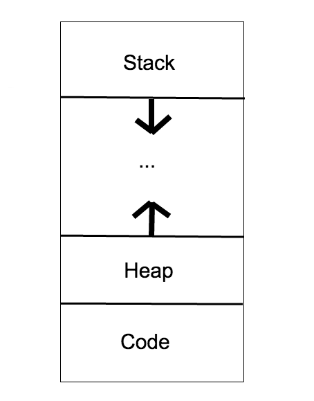

# CS50 Section. Week 5. 9/27/16.
*Tuesdays 4:00-5:30pm, CGIS S-040*

> Nicholas Boucher
> nboucher@college.harvard.edu


# Important links

* C language reference: https://reference.cs50.net/
* This week's material on Study50: [Study50](https://study.cs50.net/?toc=io,pointers,malloc)
* CS50 Discuss: https://cs50.harvard.edu/discuss
* CS50 Style Guide: https://manual.cs50.net/style/

# Section Agenda
1. Suggestions from Last Pset
2. Review of Previous Concepts
3. Redirection
4. File I/O
5. Memory Management & malloc()
6. Pointers
7. Structures


# Suggestions from Last Pset

## Use Style50

Most of the general issues that I saw on psets could have been caught by style50. Everyone seems to be doing a good job of running check50, but do be sure to run style50 and correct any issues before submitting your code.

## Required Multiline Comments

Do not forget to include the required comment stubs at the top of each file and before each function you write (except perhaps main). This is an entirely avoidable way to lose points on your psets. The following is excerpted from the Style Guide:

### Comments at the Top of Each File

```c
/**
 * hello.c
 *
 * David J. Malan
 * malan@harvard.edu
 *
 * Says hello to the world.
 */
```

### Comments Before Each function

```c
/**
 * Returns n^2 (n squared).
 */
int square(int n)
{
    return n * n;
}
```
## Magic Numbers

Magic numbers are any numbers which are "hardcoded" into your code. As a general rule, we try to avoid these hardcoded constants at all costs, since it:
* makes code harder to read and understand
* makes it more difficult and error-prone to change these values later

Instead of using magic numbers, we should instead use #define statements at the top of each pertinent file. If the values you are trying to reference could be written more sensible in ASCII, then use `char`s. For example, on pset 2 it was much better to write `'A'` than `'65'`.


# Review of Previous Concepts

## Command Line Arguments

Use the following structure for `main`:

```c
int main(int argc, string argv[])
{
    <code here>
}
```
`argc` is the argument count - the number of arguments passed to the program. `argc` is always greater than or equal to 1, since the name of the program is counted as the first argument.

`argv` is the argument vector - the actual values passed into the program. It is an array of strings, so it should be accessed using the array indexing syntax (i.e. `argv[n]`, where n is the index of the element you are trying to access). `argv[0]` is always the name of the program being executed.

## Arrays

Arrays let you store a bunch of related pieces of data in a clean, organized way.

They can be created like this:

```c
string my_classes[4];

my_classes[0] = "CS50";
my_classes[1] = "Ec 10";
my_classes[2] = "Expos 20";
my_classes[3] = "Math 55";
```

Or, you can use the following shortcut method if you know all of the data in advance:

```c
int important_years[] = {1636, 1776, 2015};
```

# Recursion

Recursive code is code in which a function makes a call to itself. Recursive algorithms need to have at least one *base case* (in which the function does not call itself) and at least one *recursive case* (in which the function does call itself).

Good example scenarios that are good candidates for recursion include a function to calculate the Fibonacci sequence and to exponentiate numbers.

# Redirection

Redirection refers to the ability to modify where a program gets its input and where it puts its output. Most of the programs in C that we have dealt with thus far scan input from the command line and output to the console. Using the magic of `bash`, which is the name for the syntax we use on the "command line", we can change the input and output locations for an existing program.

First, we must define the terms Standard Input (`STD_IN`) to be the normal method of input specified at the start of a program, which is typically the command line by default. Likewise, Standard Output (`STD_OUT`) is the normal output location specified at the start of a program. Finally, Standard Error (`STD_ERR`) is the normal location to output error messages, which by default is the same as `STD_OUT`.

The following commands are used for redirection in `bash`:

* `>`: **output**; print the output of a program to a file instead of stdout e.g. `./hello > output.txt`
  * `>>`: append to an output file instead of writing over data
  * `2>`: this is just like the above, instead it will only print out error messages to a file
* `<`: **input**; use the contents of some file as input to a program e.g. `./hello < input.txt`
* `|`: **pipe**; take the output of one program and use it as input in another e.g. `echo "hello" | wc`

# File I/O

Thus far, we have only printed to `STD_OUT`, but it is not much more difficult to write to actual files in C. To read a file, we must open it, read the data, probably process the data in some way, and then close the file. To write a file, we must open the file, write the data we want to write, and close the file.

The following program illustrates concrete examples of these tasks:

```c
#include <stdio.h>

int main(void)
{
    // open file "input.txt" in read only mode
    FILE* in = fopen("input.txt", "r");

    // always make sure fopen() doesn't return NULL!
    if(in == NULL)
        return 1;
    else
    {
        // open file "output.txt" in write only mode
        FILE* out = fopen("output.txt", "w");

        // make sure you could open file
        if(out == NULL)
            return 2;

        // get character
        int c = fgetc(in);

        while(c != EOF)
        {
            // write chracter to output file
            fputc(c, out);
            c = fgetc(in);
        }

        // close files to avoid memory leaks!
        fclose(in);
        fclose(out);
    }
}
```

The key operations here are:
* `fopen` - opening files
* `fgetc` - reading a character
* `fputc` - writing a character
* `fclose` - closing a file

Additionally, we can use the following other file operation methods:
* `fread` - reading a specifically-sized chunk of data
* `fwrite` - writing a specifically-sized chunk of data.
* `fgets` - reading a null-terminated string
* `fputs` - writing a null-terminated string

There are a couple key points to know with these functions. Regardless of what operation we are doing, we must first `fopen` the file. `fopen` returns a *pointer* to the file in memory, that is - it returns the location of the file as interpreted by the program.

The second, and very important, point is that whenever we `fopen` a file we must also remember to `fclose` it when we are done. Forgetting to `fclose` constitutes a *memory leak*, which is both bad programming practice and can pose security risks to your program.

# Memory Management & malloc()

Underneath your code, memory is laid out in a specific manner. The following chart visualizes this layout (*note - this diagram is simplified from reality*):



The **stack** is a contiguous block of memory set aside when a program starts running. Held in every stack frame is some metadata, any variables held in read-only memory, and most importantly, all local variables.

Each function that’s called gets its own stack frame, meaning, if my `main()` function called a function `sum()`, then the stack frame for `sum()` would be on top of `main()`! We have effectively pushed `sum()` on top of `main()`. If we ever want to get to the variables held in `main()` again, we’d first have to pop the `sum()` stack frame off by returning. Since each function has its own stack frame, its variables are protected from other functions and localized with their own scope.

Memory allocated during runtime is called dynamically allocated memory and it’s held on the **heap**.

For now, just try to get the general idea of memory layout.

## malloc()

Malloc is the name of a function ("Memory Allocate") where we can place data onto the heap. Remember how we got a *pointer* to the address of files when we `fopen`ed them earlier - that was an address living on the heap!

An example of this in code is:

```c
int* ptr = malloc(sizeof(int));
```

# Pointers

Watch this video: https://youtu.be/yOdd3uYC--A

Pointer are like addresses for location in memory. We use them to talk about *where* something important is.

There are three fundamental pointer operations, illustrated here with `a`, `b`, and `c`. Explain what each operation does.

**Dereference**

```c
int x = *a;
```

**Address of**

```c
int* x = &b;
```

**Assignment**

```c
*c = 5;
```
