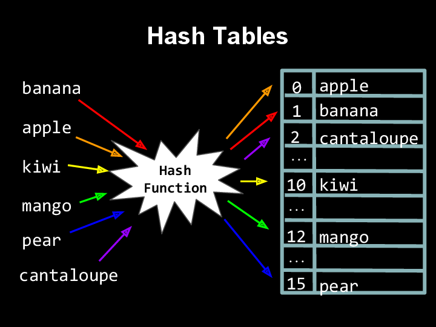

# CS50 Section. Week 6. 10/4/16.
*Tuesdays 4-5:30 PM, CGIS S-040*  

> Nicholas Boucher
> nboucher@college.harvard.edu  

# Important links
* This week's material on Study50: [Study50](https://study.cs50.net/?toc=linked_lists,hashtables,tries,trees,stacks,queues)
* C language reference: https://reference.cs50.net/
* CS50 Discuss: https://cs50.harvard.edu/discuss
* CS50 Style Guide: https://manual.cs50.net/style/

# Section Agenda

1. Notes from Past P-Set
2. Structures
3. Linked Lists
4. Hash Tables
5. Trees/Tries
6. Stacks/Queues & Huffman Coding

# Notes from Past P-Set

## Newlines

Beware of placing unnecessary newlines into your code. It is good to put one newline between functions, but you do not need more than one. Likewise, it is okay to separate out logical sections of your code within a function by using a newline. However, do not get in that habit of placing lots of blank lines in your code. There is no need for code to be longer than it has to be.

Many students are doing this:

```c
int main(void)
{
  foo();
}


void foo()
{


  printf("My code is messy.\n");

}
```

However, this is how it should be formatted:

```c
int main (void)
{
  foo();
}

void foo()
{
  printf("My code is clean.\n", );
}
```

**Use `style50` before submitting your code.**

## Debugging

Many of the problems that are coming up over email and in office hours can be solved by simply tracing through the program with `debug50`. Try to get in the habit of tracing through the execution flow of your program before asking for help -- you will become a better programmer for it.

However, as always, do not hesitate to reach out over email if you do need help.

# Structures

Structures are a tool that we can use to create new forms of data. These structures are comprised of a collection of other pre-existing types of data (such as `int`s and `char`s). Structures encapsulate data of different data types together because those different pieces of information comprise part of a larger unit.

We normally declare structures in the global scope do that they are accessible throughout the entire program.

Structures are declared using the `struct` keyword. This is an example of a structure declaration:

```c
struct student
{
   char name[40];
   char house[20];
   int year;
};
```

The data type of the structure we have just created is struct student, so if we wish to create a variable of this type, we must:

```c
struct student nicholas;
```

From there, we can assign the *fields* of that variable using the dot (.) operator:

```c
strcpy(nicholas.name, "Nicholas Boucher");
strcpy(nicholas.house, "Mather");
nicholas.year = 2019;
```
## Typedefing

If we do not want to have to type `struct` before the name of our structure every time we declare a variable of that type (e.g. `struct student nicholas;`), we can `typedef` the struct.

`Typedef`ing allows you to declare variables of any type you have designed as if it was an in-built, native type in C. Here is an example of what `typedef`ing looks like:

```c
typedef struct student
{
   char name[40];
   char house[20];
   int year;
} student;
```

This will allow us to simply create a variable of this type such as:

```c
student nicholas;
```

# Linked Lists

So far, we have been forced to use arrays for any time we want to deal with a series of data. Arrays have the drawback that they are a fixed size and cannot change sizes after declaration. It thus becomes difficult to deal with series of an unknown size.

Introducing: Linked Lists. Linked lists allow us to store a virtually unlimited amount of data in a series with the ability to modify, insert, and remove data during runtime.

Linked lists are a clever combination of two recently introduced topics: pointers and structures. Linked lists work by creating a structure which include an element that is a pointer to something *of its own type*. That is, it points to another version of itself. We call each element within this sort of list a *node*. Consider the structure declared below.

```c
typedef struct node
{
    // just some form of data; could be a char* or whatever
    int val;

    // pointer to next node; have to include `struct`
    // since this is a recursive definition
    struct node *next;

}
node;
```

Each node contains a piece of data (or perhaps multiple pieces of data) and a pointer to the next node. When we reach an element whose `next == NULL`, then we know we have reached the end of the list.

The following visualization depicts the high-level picture of how a linked list containing numbers 3,4,5,6 may look:


## Checking if an element is in a list

To find elements within a linked list, we must iterate over the array. This can be done using a `while` loop as follows:

```c
bool find(node* ptr, int val)
{
  while(ptr != NULL)
  {
      if(ptr->val == val)
      {
          return true;
      }
      else
      {
          ptr = ptr->next;
      }
  }
  return false;
}
```

Searching through a list can also be done using recursion:

```c
bool find(node* ptr, int val)
{
  if (ptr == NULL)
  {
    return false;
  }
  if (ptr->val == val)
  {
    return true;
  }
  else
  {
    return find(ptr->next, val);
  }
}
```

## Adding Elements

To add an element to a linked list, you must follow these steps:

1. Malloc space for the new list element and populate the structure with data.
2. Change the `next` pointer of the element you would like to place this new element after to point to this new element.
3. Update the `next` pointer of the new element to point to the element that was previously after the element before the new element.

This is illustrated the following code, which inserts the value at the end of the existing list:

```c
void insert(node* head, int val)
{
  node* element = malloc(sizeof(node));
  element->val = val;

  while (head->next != NULL)
  {
    head = head->next;
  }

  head->next = element;
  element->next = NULL;
}
```

Using the above code, we could create a linked list by continuing to add elements to that list:

```c
int main(void)
{
  node* head = malloc(sizeof(node));
  head->val = 1;

  insert(head, 2);
  insert(head, 3);
  insert(head, 4);

  return 0;
}
```

Of course, you could do this more efficiently by adding elements "in one pass" while looping through the linked list without having to traverse the entire list each time you add an element.

## Removing an Element

To remove an element:

1. Update the previous element's pointer to point to the following element.
2. `Free` the element you are removing.

This is illustrated in the following code, which removes one occurrence of a given value `val` from the list (returning true if it is removed and false if it is not):

```c
/* Assumption: The element we are removing is not in the
 * first node of the array. You could design code that
  * would do this, but it would be more verbose. */
bool remove (node* head, int val)
{
  node* prev = head;
  head = head->next;

  while (head != NULL)
  {
    if (head->val == val) {
      prev->next = head->next;
      free(head);
      return true;
    }
    else {
      prev = head;
      head = head->next;
    }
  }
  return false;
}
```

## Delete an Entire Linked list

To delete an entire linked list, do the following:

```c
void delete(node* head)
{
  while (head != NULL)
  {
    node* next = head->next;
    free(head);
    head = next;
  }
}
```

# Hash Tables

A hash table is basically an associative array where the position of each element in the array is decided by a hash function. A hash function can be anything; for example, if placing strings into a hash table, your hash table could be of size 26 while your function distributes words based on their first ASCII character. Alternatively, you may choose to create a larger hash table and calculate where to put a word based on the summation of a word’s characters.



A hash function describes where to insert a word and, when necessary, where to look up a word. In an ideal world a hash table will provide constant time lookup (which is possible if there are no *collisions* when inserting!) Collisions occur when a hash function places two different elements into the same "slot" in an array.

Linked Lists are, for all operations, an upper-bound of O(n) time and a lower bound of Ω(1) time.

Hash tables are, for all operations, the same. The difference is in a hash table, in the real world the upper-bound effectively becomes O(n / k), which still theoretically reduces to O(n), though has clearly noticeable optimizations with respect to real world running time.

# Trees/Tries

Trees are something that we have seen before - tries are a special kind of tree. They contain an array of pointers to the children of the current node.

See on-board demonstration in section, or for more information see the study50 links at the top of this document.

# Stacks/Queues & Huffman Coding

Stacks and queues are data structures that are essentially special kinds of linked lists. A stack is First-In-Last-Out, or FILO. That is, the most recent element added (*pushed*) to a stack is the first element to be removed (*popped*). A queue is First-In-First-Out, or FIFO. That is, the first element added (*enqueued*) is the first element to be removed (*dequeued*).

Huffman coding is a special technique that we can use to compress data (think, for example, of .zip files on your computer). Huffman coding works by replacing the ASCII values of frequently used characters with shorter values and keeping a "key" table to associate these values with their actual meaning.

For more information on these topics, see the study50 links at the top of this document.
